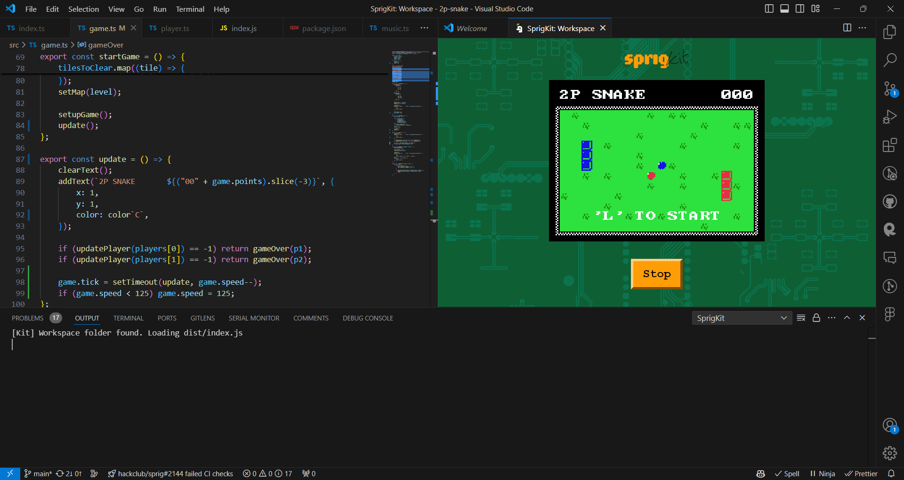

Made for Hack Club Arcade with GitHub Copilot as an assistant

# SprigKit

Making [Sprig](https://sprig.hackclub.com/) game development even easier. Create a TypeScript Sprig project using [create-sprig](./packages/create-sprig/), and develop it in your editor with the [vscode extension](./packages/vscode-extension/).

## Get started

-   Download the [vscode extension](https://marketplace.visualstudio.com/items?itemName=HackClub.sprigkit-extension)
-   Create a Sprig project by running:

```bash
npm create sprig # or equivalent
```

-   Build and start watching for file changes with:

```bash
npm run watch # or equivalent
```

-   Hit `Ctrl+P`/`Cmd+P` and type in _SprigKit_.
-   Select _SprigKit: Open game from workspace_
-   Your game should now be running in your editor. Start developing by editing `src/index.ts`



## Confessions

Used GitHub Copilot as an assistant and used [vs-sprig](https://github.com/hackclub/VS-Sprig) for inspiration for the vscode extension.

## License

Licensed under the [MIT License](./LICENSE).
